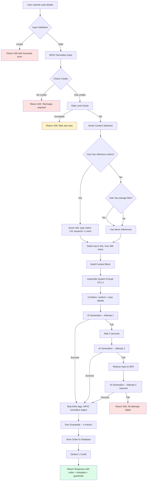
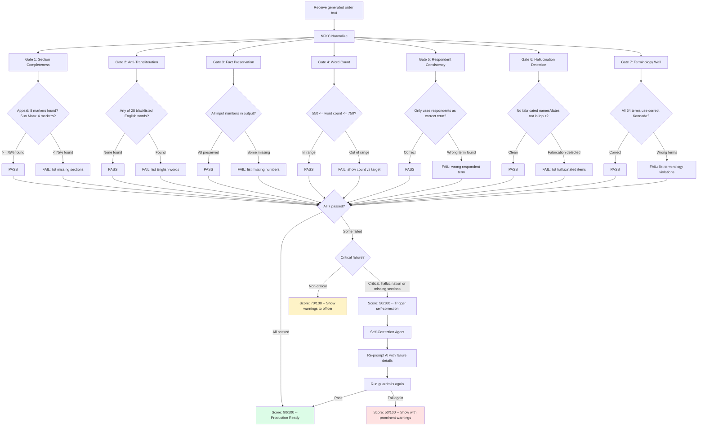
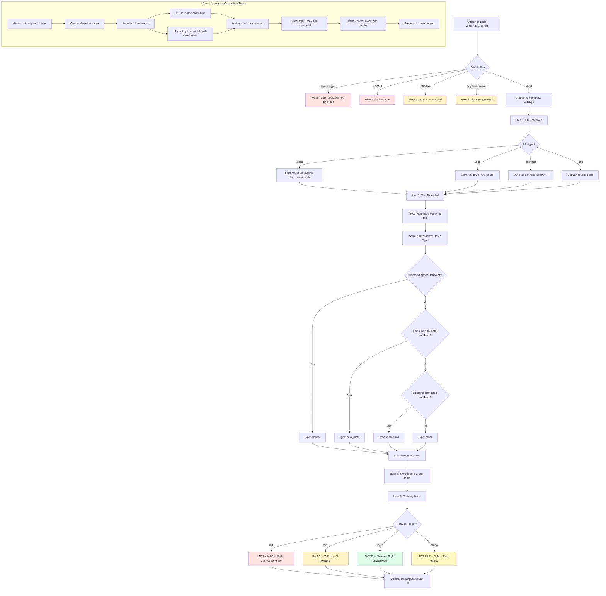
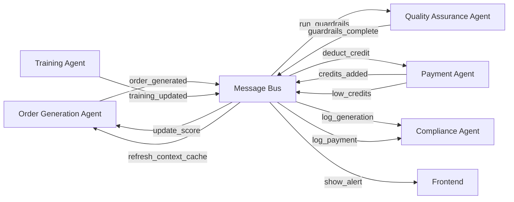

```mermaid
flowchart TD
    subgraph DPDP Compliance Engine
        DP1[Every API request] --> DP2[Log to audit_log table]
        DP2 --> DP3[Capture: user_id, action, IP, user_agent, metadata, timestamp]

        DP4[User requests data export] --> DP5[Generate complete data package]
        DP5 --> DP6[All orders + training files + profile + transactions]
        DP6 --> DP7[Encrypted ZIP download]

        DP8[User requests deletion] --> DP9{Officer transferred?}
        DP9 -->|Yes| DP10[ARCHIVE mode: anonymize, retain structure for audit]
        DP9 -->|No, voluntary| DP11{Pending orders or active subscription?}
        DP11 -->|Yes| DP12[Warn: complete pending items first]
        DP11 -->|No| DP13[Schedule deletion after 30-day cooling period]
        DP13 --> DP14[Anonymize personal data]
        DP14 --> DP15[Retain anonymized audit trail for 7 years]
    end

    subgraph Audit Logging System
        AL1[Order generated] --> AL2[Log: user, type, model, score, time, guardrail results]
        AL3[Document downloaded] --> AL4[Log: user, format, IP, user_agent]
        AL5[Payment made] --> AL6[Log: user, pack, amount, razorpay IDs]
        AL7[File uploaded] --> AL8[Log: user, filename, size, detected type]
        AL9[Login/logout] --> AL10[Log: user, method, IP, device]
        AL11[Settings changed] --> AL12[Log: user, what changed, old value, new value]
    end

    subgraph Data Retention Policy
        DR1[Order data] --> DR2[Retain: 3 years from creation]
        DR3[Audit logs] --> DR4[Retain: 7 years -- regulatory requirement]
        DR5[Training files] --> DR6[Retain: while user active + 90 days after deletion]
        DR7[Payment records] --> DR8[Retain: 7 years -- tax/legal requirement]
        DR9[Session data] --> DR10[Retain: 30 days]
    end

    subgraph Transfer Mode
        TM1[Officer transferred] --> TM2[Admin triggers transfer mode]
        TM2 --> TM3[Archive all training data -- DO NOT DELETE]
        TM3 --> TM4[Anonymize personal identifiers]
        TM4 --> TM5[Retain order history for audit]
        TM5 --> TM6[New officer starts with clean training state]
        TM6 --> TM7[Credits: transfer remaining balance to new account]
    end

    subgraph Access Control Matrix
        AC1[Role: Officer] --> AC2[Can: generate, upload, download, view own orders]
        AC3[Role: Admin] --> AC4[Can: view all users, manage transfers, view audit logs]
        AC5[Role: System] --> AC6[Can: run guardrails, deduct credits, write audit logs]
        AC7[Role: Public] --> AC8[Can: view pricing, register, login]
    end

    subgraph Anomaly Detection
        AD1[Monitor generation patterns] --> AD2{Anomaly checks}
        AD2 --> AD3{> 50 orders/day?}
        AD3 -->|Yes| AD4[FLAG: Unusual volume -- possible script abuse]
        AD2 --> AD5{Same input repeated > 5 times?}
        AD5 -->|Yes| AD6[FLAG: Possible credit farming]
        AD2 --> AD7{Generation at unusual hours?}
        AD7 -->|2am-5am, gov office closed| AD8[FLAG: Suspicious timing]
        AD2 --> AD9{Multiple IPs in short time?}
        AD9 -->|Yes| AD10[FLAG: Possible credential sharing]
        AD4 & AD6 & AD8 & AD10 --> AD11[Alert admin via email]
    end

    style DP7 fill:#dcfce7
    style DP15 fill:#dbeafe
    style TM7 fill:#dcfce7
    style AD11 fill:#fef3c7
```

# Aadesh AI -- Agentic Workflows Architecture

**Version:** 1.0
**Date:** 2026-03-29
**Status:** Architecture Design (Pre-Implementation)
**Project:** Aadesh AI (SaaS) -- Karnataka DDLR Government Order Generation

---

## Table of Contents

1. [Architecture Overview](#1-architecture-overview)
2. [Workflow 1: Order Generation Agent](#2-workflow-1-order-generation-agent)
3. [Workflow 2: Quality Assurance Agent](#3-workflow-2-quality-assurance-agent)
4. [Workflow 3: Training & Personalization Agent](#4-workflow-3-training--personalization-agent)
5. [Workflow 4: Payment & Credit Management Agent](#5-workflow-4-payment--credit-management-agent)
6. [Workflow 5: Compliance & Audit Agent](#6-workflow-5-compliance--audit-agent)
7. [Inter-Agent Communication](#7-inter-agent-communication)
8. [Claude Agent SDK Integration Plan](#8-claude-agent-sdk-integration-plan)
9. [Implementation Roadmap](#9-implementation-roadmap)

---

## 1. Architecture Overview

### System Context

Aadesh AI is a self-service SaaS platform for Karnataka land-record offices. Each DDLR caseworker uploads their best finalized orders, the AI learns their writing style, and generates new order drafts in Sarakari Kannada. The system processes two order types: **Appeal Orders** (13 mandatory sections) and **Suo Motu Review Orders** (8 sections).

### Current Architecture (Monolithic API Routes)

```
src/
  app/api/
    generate-order/route.ts    -- Single 195-line handler: auth + rate limit + credits + smart context + generation + guardrails + save + deduct
    razorpay/route.ts          -- Payment creation (POST) + verification (PUT) in one file
    download/route.ts          -- DOCX/PDF generation with audit logging
    orders/route.ts            -- Order history with pagination and search
  lib/
    sarvam.ts                  -- Sarvam 105B API integration with 3-attempt retry
    guardrails.ts              -- 4 guardrail checks (section, transliteration, fact, word count)
    smart-context.ts           -- Reference selection: user refs > demo refs, scored by type + keyword overlap
    system-prompt.ts           -- V3.2.1 master prompt (382 lines, 17 absolute rules)
    pricing.ts                 -- 4 recharge packs (Pack A-D)
    rateLimit.ts               -- In-memory sliding window (10 req/min/user)
```

### Target Architecture (5 Agentic Workflows)

```
                          +---------------------+
                          |  Aadesh AI Frontend  |
                          |  (Next.js App)       |
                          +----------+----------+
                                     |
                          +----------v----------+
                          |   API Gateway Layer  |
                          |  (Next.js Routes)    |
                          +----------+----------+
                                     |
         +---------------------------+---------------------------+
         |              |            |            |              |
   +-----v-----+ +-----v-----+ +---v---+ +------v------+ +-----v-----+
   |  Order     | |  Quality  | |Training| |  Payment   | | Compliance|
   | Generation | | Assurance | |  &     | |  & Credit  | |  & Audit  |
   |  Agent     | |  Agent    | |Personal| | Management | |  Agent    |
   +-----+-----+ +-----+-----+ | Agent  | |   Agent    | +-----+-----+
         |              |       +---+---+ +------+------+       |
         |              |           |            |              |
   +-----v--------------v-----------v------------v--------------v-----+
   |                        Shared Services                           |
   |  Supabase (DB + Auth + Storage) | Sarvam API | OpenRouter API    |
   |  Razorpay | Audit Log | Rate Limiter | NFKC Normalizer           |
   +----------------------------------------------------------------------+
```

### Design Principles

| Principle | Description |
|-----------|-------------|
| **Single Responsibility** | Each agent owns one domain. No agent reaches into another agent's data without going through the defined interface. |
| **Fail-Safe Defaults** | Every agent has retry logic, fallback behavior, and graceful degradation. A payment failure never blocks generation. |
| **Kannada-First** | All text processing uses NFKC normalization. Error messages are bilingual (Kannada primary, English secondary). |
| **Cost Awareness** | Agents track cost per operation. Smart routing sends simple cases to free Sarvam, complex cases to paid Sonnet. |
| **Audit Everything** | Every state transition is logged. Every agent reports its actions to the Compliance Agent. |

---

## 2. Workflow 1: Order Generation Agent

### Purpose

Orchestrates the complete 19-stage pipeline from raw case input to a formatted, quality-checked government order ready for officer verification and download.

### Mermaid Diagram



### Input Specification

```typescript
interface OrderGenerationInput {
  // Required
  orderType: 'appeal' | 'suo_motu';
  caseDetails: string;              // Max 10,000 characters

  // Derived from auth
  userId: string;                   // From JWT token
  accessToken: string;              // Bearer token

  // Optional (Phase 1B)
  preferredModel?: 'sarvam' | 'sonnet' | 'gemini';
  urgency?: 'normal' | 'priority';
}
```

### Output Specification

```typescript
interface OrderGenerationOutput {
  success: boolean;
  order: string;                    // Full Kannada order text
  orderId: string | null;           // Database ID
  metadata: {
    wordCount: number;              // Target: 550-750
    model: string;                  // e.g., 'sarvam-m'
    tokensUsed: number;
    orderType: string;
    generationTime: string;         // e.g., '8.3s'
    generatedAt: string;            // ISO timestamp
    creditsRemaining: number;
    refsUsed: number;               // How many reference orders used
    totalRefs: number;              // Total available refs
    refSource: 'user' | 'demo';
  };
  guardrails: {
    results: GuardrailResult[];     // 4 individual check results
    allPassed: boolean;
    summary: string;                // e.g., '4/4 guardrails passed'
    summaryKn: string;              // Kannada summary
  };
}
```

### Decision Points

| Decision | Condition | Action |
|----------|-----------|--------|
| Input too long | `caseDetails.length > 10,000` | Reject with 400 |
| No API key | `!process.env.SARVAM_API_KEY` | Return 500 server config error |
| No credits | `credits_remaining <= 0` | Return 402, prompt recharge |
| Rate limited | `> 10 requests/min` | Return 429 with retry-after |
| No user refs | References table empty for user | Fall back to 5 demo references |
| API attempt 1 fails | Network/timeout error | Wait 3s, retry with full context |
| API attempt 2 fails | Second failure | Retry with 50% reduced input |
| API attempt 3 fails | All attempts exhausted | Return 500 with Kannada error |
| Timeout detected | Error message contains 'timeout' | Return specific timeout error in Kannada |

### Error Handling

```
Attempt 1 (full context) --FAIL--> 3s delay
Attempt 2 (full context) --FAIL--> reduce input to 50%
Attempt 3 (reduced)      --FAIL--> throw with Kannada message
```

**Fallback Model Routing (Planned Phase 1B):**

```
Simple case (< 500 chars, standard appeal) --> Sarvam 105B (FREE, 90/100)
Complex case (> 500 chars, multiple parties) --> Claude Sonnet via OpenRouter (Rs 12, 96/100)
Premium user request                        --> User's chosen model
All models fail                             --> Queue for retry + notify user
```

### Current Implementation Status

| Stage | Status | File |
|-------|--------|------|
| 1. Receive input | DONE | `src/app/api/generate-order/route.ts` lines 38-60 |
| 2. OCR (Sarvam Vision) | PLANNED | Not yet implemented -- users paste text |
| 3. Auto-detect order type | PARTIAL | User selects manually; auto-detect in train page only |
| 4. Auto-extract facts | PLANNED | Not yet implemented |
| 5. Smart context selection | DONE | `src/lib/smart-context.ts` -- full scoring system |
| 6. System prompt assembly | DONE | `src/lib/system-prompt.ts` -- V3.2.1, 382 lines |
| 7. AI generation | DONE | `src/lib/sarvam.ts` -- 3-attempt retry |
| 8. Self-correction pass | PLANNED | Not yet implemented |
| 9. Terminology check | DONE | `src/lib/guardrails.ts` -- anti-transliteration |
| 10. Structure validation | DONE | `src/lib/guardrails.ts` -- section completeness |
| 11. Fact cross-check | DONE | `src/lib/guardrails.ts` -- number preservation |
| 12. Word count check | DONE | `src/lib/guardrails.ts` -- 550-750 range |
| 13. Placeholder fill | PARTIAL | System prompt has placeholders; dynamic fill planned |
| 14. Markdown strip | DONE | `src/lib/sarvam.ts` -- strips think tags |
| 15. Format for DOCX | DONE | `src/app/api/download/route.ts` |
| 16. Bold headers | DONE | `src/app/api/download/route.ts` -- auto-detects headers |
| 17. Table conversion | PLANNED | Not yet implemented |
| 18. Generate DOCX/PDF | DONE (DOCX) / PARTIAL (PDF) | DOCX works; PDF falls back to DOCX |
| 19. Deliver | DONE | Download endpoint with content-disposition |

### Claude Agent SDK Integration

```python
# Phase 1B: Order Generation as a Claude Agent SDK tool

from claude_agent_sdk import Agent, Tool

class OrderGenerationAgent(Agent):
    """Orchestrates the full DDLR order generation pipeline."""

    tools = [
        Tool("validate_input", validate_case_input),
        Tool("check_credits", check_user_credits),
        Tool("fetch_smart_context", get_smart_context),
        Tool("generate_order", call_sarvam_api),
        Tool("run_guardrails", run_all_guardrails),
        Tool("save_order", save_to_database),
        Tool("format_document", generate_docx_or_pdf),
    ]

    system_prompt = """
    You are the Order Generation Agent for Aadesh AI.
    Given case details, orchestrate the pipeline:
    1. Validate input (type, length, format)
    2. Check credits (reject if zero)
    3. Fetch smart context (user refs or demo)
    4. Generate order via Sarvam API (3 attempts)
    5. Run guardrails (all 4 must pass for score 90)
    6. Save order and deduct credit
    7. Return formatted result
    If guardrails fail, attempt self-correction before returning.
    """
```

---

## 3. Workflow 2: Quality Assurance Agent

### Purpose

Automated, zero-cost quality gate that validates every generated order against 7 accuracy guardrails before the officer sees it. Prevents hallucinated content, missing sections, English transliterations, and fact distortion from reaching production.

### Mermaid Diagram



### Input Specification

```typescript
interface QAInput {
  orderText: string;                  // Generated Kannada order
  orderType: 'appeal' | 'suo_motu';
  inputText: string;                  // Original case details for fact-check
  officerProfile?: OfficerProfile;    // For placeholder validation
}
```

### Output Specification

```typescript
interface QAOutput {
  results: GuardrailResult[];    // Individual gate results
  allPassed: boolean;            // True only if ALL 7 gates pass
  score: number;                 // 90 (all pass) | 70 (non-critical fail) | 50 (critical fail)
  summary: string;               // "4/4 guardrails passed"
  summaryKn: string;             // Kannada version
  selfCorrectionAttempted: boolean;
  selfCorrectionSucceeded: boolean;
}
```

### Gate Specifications

| Gate | ID | Check Logic | Pass Threshold | Cost |
|------|----|-------------|----------------|------|
| **Section Completeness** | `section-completeness` | Count Kannada section markers in output | >= 75% of expected markers (6/8 appeal, 3/4 suo motu) | Free |
| **Anti-Transliteration** | `anti-transliteration` | Regex match 28 blacklisted English words | 0 English words found | Free |
| **Fact Preservation** | `fact-preservation` | Extract all numbers from input, verify each in output | 100% of input numbers present | Free |
| **Word Count** | `word-count` | Split on whitespace, count tokens | 550-750 words | Free |
| **Respondent Consistency** | `respondent-check` | Verify only correct Kannada term used (never wrong term) | Correct term only | Free |
| **Hallucination Detection** | `hallucination-check` | Compare proper nouns/dates in output vs input | No fabricated entities | Free |
| **Terminology Wall** | `terminology-wall` | Check all 64 mandatory terms against dictionary | No wrong terms | Free |

### Current Implementation Status

| Gate | Status | Location |
|------|--------|----------|
| Section Completeness | DONE | `guardrails.ts:checkSectionCompleteness()` -- 8 appeal markers, 4 suo motu markers |
| Anti-Transliteration | DONE | `guardrails.ts:checkAntiTransliteration()` -- 28 English words blacklisted |
| Fact Preservation | DONE | `guardrails.ts:checkFactPreservation()` -- extracts numbers from input, checks output |
| Word Count | DONE | `guardrails.ts:checkWordCount()` -- 550-750 range |
| Respondent Consistency | PLANNED | Not yet -- needs check for wrong term usage |
| Hallucination Detection | PLANNED | Not yet -- needs NER comparison between input and output |
| Terminology Wall | PLANNED | Not yet -- needs full 64-term dictionary check |
| Self-Correction Loop | PLANNED | Not yet -- would re-prompt with failure details |

### Claude Agent SDK Integration

```python
class QualityAssuranceAgent(Agent):
    """Validates generated orders against 7 accuracy guardrails."""

    tools = [
        Tool("check_sections", check_section_completeness),
        Tool("check_transliteration", check_anti_transliteration),
        Tool("check_facts", check_fact_preservation),
        Tool("check_word_count", check_word_count),
        Tool("check_respondent", check_respondent_consistency),
        Tool("detect_hallucination", detect_hallucinations),
        Tool("check_terminology", check_terminology_wall),
        Tool("self_correct", trigger_self_correction),
    ]

    system_prompt = """
    You are the Quality Assurance Agent for Aadesh AI.
    Run ALL 7 guardrails on every generated order.
    If any critical gate fails (hallucination or missing sections),
    trigger the self-correction tool to fix the order.
    Never let a hallucinated order reach the officer.
    Return a scored report with pass/fail for each gate.
    """
```

---

## 4. Workflow 3: Training & Personalization Agent

### Purpose

Manages the complete lifecycle of officer-uploaded reference orders: file reception, text extraction, order type detection, style analysis, reference indexing, and progressive training level tracking. As more orders are uploaded, the AI learns the officer's personal writing style, producing increasingly accurate drafts.

### Mermaid Diagram



### Input Specification

```typescript
interface TrainingUploadInput {
  file: File;                        // .docx, .pdf, .jpg, .png, .doc
  userId: string;                    // From auth
}

interface SmartContextRequest {
  userId: string;
  orderType: 'appeal' | 'suo_motu';
  caseDetails: string;               // For keyword matching
}
```

### Output Specification

```typescript
interface TrainingUploadOutput {
  success: boolean;
  steps: {
    received: boolean;
    textExtracted: boolean;
    typeDetected: boolean;
    stored: boolean;
  };
  detectedType: string;
  wordCount: number;
  trainingLevel: 'untrained' | 'basic' | 'good' | 'expert';
  progressPercent: number;
}

interface SmartContextResult {
  referenceExcerpts: string[];       // Top 5 reference texts
  refsUsed: number;
  totalRefs: number;
  source: 'user' | 'demo';
}
```

### Training Level Progression

| Level | Files | Progress | Quality Impact |
|-------|-------|----------|----------------|
| **Untrained** | 0-4 | 0-20% | Cannot generate. Demo references only. Generic style. |
| **Basic** | 5-9 | 20-50% | Can generate. Learning basic patterns. Some style mismatch. |
| **Good** | 10-19 | 50-80% | Good quality. Style understood. Most sections match officer's voice. |
| **Expert** | 20-50 | 80-100% | Best quality. Full personalization. Drafts match officer's exact style. |

### How Training Improves Over Time

```
Files 1-4:   System uses 5 demo references (generic DDLR style)
             Output is correct but generic -- "one size fits all"

Files 5-9:   System scores user references by type + keyword overlap
             Output starts matching the officer's preferred phrasing

Files 10-19: With 10+ references, same-type matches become strong
             The AI can distinguish appeal vs suo motu style per officer

Files 20+:   Deep keyword overlap scoring + diverse reference pool
             The AI matches the officer's specific narrative flow,
             preferred legal phrases, and characteristic paragraph structure
```

### Decision Points

| Decision | Condition | Action |
|----------|-----------|--------|
| File type check | Extension not in allowed list | Reject with error message |
| File size limit | > 10MB | Reject with size error |
| Max files reached | >= 50 files uploaded | Reject with limit message |
| Duplicate file | Same sanitized name exists | Reject with duplicate message |
| No text extracted | Extraction returns empty | Mark as error, notify user |
| OCR needed | File is .jpg or .png | Route through Sarvam Vision API |
| Type detection fails | No markers match | Default to "other" type |
| No user refs at generation time | 0 files in references table | Fall back to 5 demo references |
| Context too large | Total chars > 40,000 | Stop adding references |

### Current Implementation Status

| Feature | Status | Location |
|---------|--------|----------|
| File upload to Supabase Storage | DONE | `src/app/app/train/page.tsx` |
| File type validation | DONE | `.docx .pdf .doc .jpg .png` |
| Size validation | DONE | 10MB limit |
| Max file limit | DONE | 50 files |
| Duplicate detection | DONE | Sanitized filename comparison |
| Text extraction (DOCX) | SIMULATED | Client-side placeholder; server-side extraction planned |
| Text extraction (PDF) | SIMULATED | Client-side placeholder |
| OCR (images) | PLANNED | Sarvam Vision API integration |
| Auto-detect order type | PARTIAL | Filename-based detection on client; content-based planned |
| Store in references table | PARTIAL | Files stored in Storage; references table schema ready |
| Smart context scoring | DONE | `smart-context.ts` -- type match (+10), keyword (+1) |
| Reference selection (top 5) | DONE | `smart-context.ts` -- max 5 refs, 40K char budget |
| Demo reference fallback | DONE | 5 hardcoded demo references |
| Training level calculation | DONE | `TrainingStatusBar.tsx` -- 4 levels |
| Progress bar UI | DONE | Visual progress with encouragement messages |
| Processing pipeline UI | DONE | 4-step progress visualization per file |

### Claude Agent SDK Integration

```python
class TrainingAgent(Agent):
    """Manages officer training data lifecycle and personalization."""

    tools = [
        Tool("extract_text_docx", extract_text_from_docx),
        Tool("extract_text_pdf", extract_text_from_pdf),
        Tool("ocr_image", call_sarvam_vision),
        Tool("detect_order_type", classify_order_type),
        Tool("analyze_style", extract_style_patterns),
        Tool("index_reference", store_in_references_table),
        Tool("get_training_level", calculate_training_level),
        Tool("build_style_profile", build_officer_style_profile),
    ]

    system_prompt = """
    You are the Training & Personalization Agent for Aadesh AI.
    When an officer uploads a file:
    1. Extract text (use OCR for images)
    2. Detect order type from content markers
    3. Analyze writing style (sentence length, preferred phrases, structure)
    4. Index in the references table with metadata
    5. Update training level
    Over time, build a rich style profile per officer.
    """
```

---

## 5. Workflow 4: Payment & Credit Management Agent

### Purpose

Handles the complete payment lifecycle: Razorpay order creation, payment verification with cryptographic signature check, credit addition via database RPC, transaction recording, usage tracking, low-credit alerts, and smart routing to optimize cost per order.

### Mermaid Diagram

```mermaid
flowchart TD
    A[Officer clicks Buy on billing page] --> B{Which pack?}
    B -->|Pack A| B1["Rs 499 / 30 orders (Rs 16.6/order)"]
    B -->|Pack B| B2["Rs 999 / 75 orders (Rs 13.3/order)"]
    B -->|Pack C| B3["Rs 1,999 / 200 orders (Rs 10.0/order)"]
    B -->|Pack D| B4["Rs 4,999 / 600 orders (Rs 8.3/order)"]

    B1 & B2 & B3 & B4 --> C[POST /api/razorpay]
    C --> C1{Razorpay credentials configured?}
    C1 -->|No| C_ERR[Return 500: Not configured]
    C1 -->|Yes| C2[Create Razorpay order via API]
    C2 --> C3[Return order_id + key_id to frontend]

    C3 --> D[Open Razorpay Checkout Modal]
    D --> D1{Payment outcome?}
    D1 -->|User cancels| D_CANCEL[Reset UI state]
    D1 -->|Payment succeeds| E[Receive payment credentials]

    E --> F[PUT /api/razorpay -- Verify Payment]
    F --> F1[Compute HMAC-SHA256 signature]
    F1 --> F2{Signatures match?}
    F2 -->|No| F_ERR[Return 400: Invalid signature]
    F2 -->|Yes| G[Add credits via RPC]

    G --> G1[Call add_credits RPC in Supabase]
    G1 --> G2{RPC success?}
    G2 -->|No| G_ERR[Return 500: Credit addition failed]
    G2 -->|Yes| H[Record transaction in transactions table]

    H --> I[Return success + credits added count]
    I --> J[Frontend shows success message]
    J --> K[Refresh profile to show new balance]

    subgraph Smart Routing -- Cost Optimization
        SR1[Generation request arrives] --> SR2{Case complexity?}
        SR2 -->|Simple: < 500 chars standard appeal| SR3["Route to Sarvam 105B (FREE, 90/100)"]
        SR2 -->|Complex: multiple parties, large input| SR4["Route to Sonnet via OpenRouter (Rs 12, 96/100)"]
        SR2 -->|User chose premium| SR5[Route to user's preferred model]
        SR3 & SR4 & SR5 --> SR6[Deduct 1 credit regardless of model]
    end

    subgraph Low Credit Alert System
        LA1[After each generation] --> LA2{Credits remaining?}
        LA2 -->|<= 5| LA3[Show amber warning banner]
        LA2 -->|= 0| LA4[Show red banner + block generation]
        LA2 -->|> 5| LA5[No alert]
    end

    style C_ERR fill:#fee2e2
    style F_ERR fill:#fee2e2
    style G_ERR fill:#fee2e2
    style D_CANCEL fill:#f3f4f6
    style J fill:#dcfce7
```

### Input Specification

```typescript
// Create order
interface PaymentCreateInput {
  packId: 'pack_a' | 'pack_b' | 'pack_c' | 'pack_d';
  userId: string;        // From auth
}

// Verify payment
interface PaymentVerifyInput {
  razorpay_order_id: string;
  razorpay_payment_id: string;
  razorpay_signature: string;
  packId: string;
  userId: string;        // From auth
}
```

### Output Specification

```typescript
// Create order response
interface PaymentCreateOutput {
  orderId: string;       // Razorpay order ID
  amount: number;        // In paise
  currency: 'INR';
  packName: string;
  ordersInPack: number;
  keyId: string;         // Razorpay public key
}

// Verify payment response
interface PaymentVerifyOutput {
  success: boolean;
  message: string;
  creditsAdded: number;
}
```

### Cost Optimization Logic

```
Current State:
  ALL orders use Sarvam 105B (FREE) = Rs 0 per order
  Revenue at Pack D: Rs 4,999 / 600 orders = Rs 8.3/order
  Margin at Pack D: Rs 8.3 - Rs 0 = Rs 8.3 (100% margin with Sarvam)

Problem:
  Packs A-C are unprofitable at Rs 30/order if Sonnet is used
  Pack A: Rs 16.6/order - Rs 12 Sonnet = Rs 4.6 margin (thin)
  Pack D: Rs 8.3/order - Rs 12 Sonnet = -Rs 3.7 (LOSS with Sonnet)

Smart Routing Solution (Phase 1B):
  Simple cases (80% of volume) --> Sarvam (FREE, 90/100)
  Complex cases (20% of volume) --> Sonnet (Rs 12, 96/100)

  Blended cost per order:
    (0.80 x Rs 0) + (0.20 x Rs 12) = Rs 2.4 average

  Pack D margin with smart routing:
    Rs 8.3 - Rs 2.4 = Rs 5.9/order (71% margin)

  ALL packs become profitable with smart routing.
```

### Decision Points

| Decision | Condition | Action |
|----------|-----------|--------|
| Invalid pack | packId not in A/B/C/D | Return 400 |
| No Razorpay config | Missing KEY_ID or SECRET | Return 500 |
| Razorpay API fails | Order creation HTTP error | Return 500 with error |
| User cancels payment | Modal dismissed | Reset loading state |
| Signature mismatch | HMAC verification fails | Return 400: invalid signature |
| RPC fails | add_credits database error | Return 500: credit addition failed |
| Low credits | <= 5 remaining | Show warning banner |
| Zero credits | = 0 remaining | Block generation, show recharge prompt |

### Current Implementation Status

| Feature | Status | Location |
|---------|--------|----------|
| Razorpay order creation | DONE | `src/app/api/razorpay/route.ts` POST handler |
| HMAC-SHA256 signature verification | DONE | `src/app/api/razorpay/route.ts` PUT handler |
| Credit addition via RPC | DONE | `add_credits` Supabase RPC function |
| Transaction recording | DONE | Inserts into `transactions` table |
| 4 pack definitions | DONE | Pack A-D with pricing |
| Razorpay checkout modal | DONE | `src/app/app/billing/page.tsx` |
| Auth on verify endpoint | DONE | Fixed 2026-03-29 -- was missing |
| Credit deduction per generation | DONE | `generate-order/route.ts` line 145 |
| Credit check before generation | DONE | `generate-order/route.ts` line 93 |
| Smart routing (free vs paid) | PLANNED | Not yet -- all orders use Sarvam |
| Low credit alerts | PLANNED | Not yet -- needs frontend banner |
| Usage analytics dashboard | PLANNED | Not yet |
| Subscription/auto-renew | PLANNED | Currently one-time packs only |

### Claude Agent SDK Integration

```python
class PaymentAgent(Agent):
    """Manages payment processing, credits, and cost optimization."""

    tools = [
        Tool("create_razorpay_order", create_payment_order),
        Tool("verify_payment", verify_razorpay_signature),
        Tool("add_credits", add_credits_to_profile),
        Tool("check_credits", get_remaining_credits),
        Tool("route_model", determine_optimal_model),
        Tool("record_transaction", log_transaction),
        Tool("check_low_credit", evaluate_credit_alerts),
        Tool("get_usage_stats", fetch_usage_analytics),
    ]

    system_prompt = """
    You are the Payment & Credit Management Agent for Aadesh AI.
    Handle all payment operations:
    1. Create Razorpay orders for selected packs
    2. Verify payments with cryptographic signatures
    3. Add credits atomically via database RPC
    4. Track usage and alert on low credits
    5. Route generation requests to the cheapest model
       that meets quality threshold (90+ score)
    Never process a payment without signature verification.
    Never add credits without recording the transaction.
    """
```

---

## 6. Workflow 5: Compliance & Audit Agent

### Purpose

Ensures the system meets India's Digital Personal Data Protection Act (DPDP) 2023 requirements, maintains comprehensive audit trails, enforces data retention policies, handles officer transfers with data archival (not deletion), manages role-based access control, and detects anomalous usage patterns.

### Mermaid Diagram



### Input Specification

```typescript
interface AuditLogEntry {
  user_id: string;
  action: string;                     // e.g., 'generated_order', 'downloaded_docx'
  ip_address: string;
  user_agent: string;
  metadata: Record<string, unknown>;  // Action-specific data
  timestamp?: string;                 // Auto-set if not provided
}

interface TransferRequest {
  outgoing_user_id: string;
  incoming_user_id?: string;          // Optional: if new officer already registered
  reason: 'transfer' | 'retirement' | 'voluntary';
  admin_user_id: string;
}

interface DataExportRequest {
  user_id: string;
  format: 'json' | 'zip';
  include: ('orders' | 'training' | 'profile' | 'transactions' | 'audit')[];
}
```

### Output Specification

```typescript
interface AuditReport {
  totalEvents: number;
  byAction: Record<string, number>;
  anomalies: AnomalyFlag[];
  complianceStatus: {
    dpdpCompliant: boolean;
    auditLogsCurrent: boolean;
    retentionPoliciesMet: boolean;
    dataExportAvailable: boolean;
  };
}

interface AnomalyFlag {
  type: 'high_volume' | 'repeated_input' | 'odd_hours' | 'multi_ip';
  severity: 'low' | 'medium' | 'high';
  userId: string;
  details: string;
  timestamp: string;
}
```

### Regulatory Compliance Flow

```
DPDP Act 2023 Requirements:
  1. Informed consent              --> Registration flow includes terms
  2. Purpose limitation            --> Data used only for order generation
  3. Data minimization             --> We store only what's needed
  4. Storage limitation            --> Retention policies enforced
  5. Accuracy                      --> NFKC normalization, guardrails
  6. Security                      --> Supabase RLS, encrypted storage
  7. Right to access               --> Data export feature
  8. Right to correction           --> Profile edit + order re-generation
  9. Right to erasure              --> Deletion with 30-day cooling period
  10. Grievance redressal          --> Contact support flow
  11. Data Protection Officer      --> Designated contact (planned)
```

### Decision Points

| Decision | Condition | Action |
|----------|-----------|--------|
| Audit log write fails | Database error | Console.error only -- never block user action |
| Data export requested | Valid user session | Generate encrypted ZIP within 24 hours |
| Deletion requested | User has active credits | Warn: credits will be lost |
| Officer transferred | Admin-initiated | Archive mode: anonymize, retain structure |
| Anomaly detected | Any flag triggered | Log alert, notify admin |
| Retention expired | Order > 3 years old | Mark for archival, exclude from active queries |
| Multi-IP login | > 3 IPs in 1 hour | Flag for review, do not auto-block |

### Current Implementation Status

| Feature | Status | Location |
|---------|--------|----------|
| Audit logging on download | DONE | `src/app/api/download/route.ts` line 54 |
| IP address capture | DONE | `x-real-ip` / `x-forwarded-for` headers |
| User agent capture | DONE | `user-agent` header |
| Metadata on audit log | DONE | Format, orderType, wordCount |
| Auth on all API routes | DONE | Bearer token verification |
| RLS on Supabase tables | DONE | Supabase policies |
| Credit check before generation | DONE | Prevents unauthorized generation |
| Transaction recording | DONE | Payment records in transactions table |
| Data export (user data) | PLANNED | Not yet |
| Right to erasure flow | PLANNED | Not yet |
| Transfer mode (archive) | PLANNED | Not yet |
| Anomaly detection | PLANNED | Not yet |
| Admin dashboard | PLANNED | Not yet |
| Low-credit alerts | PLANNED | Not yet |
| Retention policy automation | PLANNED | Not yet |
| Data Protection Officer designation | PLANNED | Not yet |

### Claude Agent SDK Integration

```python
class ComplianceAgent(Agent):
    """Ensures DPDP compliance, audit trails, and anomaly detection."""

    tools = [
        Tool("log_audit_event", write_to_audit_log),
        Tool("check_compliance_status", evaluate_dpdp_compliance),
        Tool("export_user_data", generate_data_export),
        Tool("process_deletion", handle_erasure_request),
        Tool("process_transfer", handle_officer_transfer),
        Tool("detect_anomalies", run_anomaly_detection),
        Tool("generate_audit_report", create_audit_report),
        Tool("check_retention", evaluate_retention_policies),
        Tool("alert_admin", send_admin_notification),
    ]

    system_prompt = """
    You are the Compliance & Audit Agent for Aadesh AI.
    Your responsibilities:
    1. Log every significant system event
    2. Monitor for DPDP compliance gaps
    3. Process data export and deletion requests
    4. Handle officer transfers (archive, never delete)
    5. Detect and flag anomalous usage patterns
    6. Generate audit reports on demand
    Never delete training data on transfer -- always archive.
    Always retain audit logs for 7 years.
    Never block a user action because of an audit log failure.
    """
```

---

## 7. Inter-Agent Communication

### Message Bus Architecture (Phase 1B)



### Event Definitions

| Event | Producer | Consumer(s) | Payload |
|-------|----------|-------------|---------|
| `order_generated` | Generation Agent | QA, Payment, Compliance | `{ orderId, userId, orderType, model, wordCount }` |
| `guardrails_complete` | QA Agent | Generation Agent | `{ orderId, allPassed, score, results[] }` |
| `credit_deducted` | Payment Agent | Compliance Agent | `{ userId, creditsRemaining, orderId }` |
| `credits_added` | Payment Agent | Compliance Agent, Frontend | `{ userId, amount, packName, transactionId }` |
| `low_credits` | Payment Agent | Frontend | `{ userId, remaining, threshold }` |
| `training_updated` | Training Agent | Generation Agent | `{ userId, fileCount, trainingLevel }` |
| `file_uploaded` | Training Agent | Compliance Agent | `{ userId, fileName, fileType, size }` |
| `anomaly_detected` | Compliance Agent | Admin Dashboard | `{ type, severity, userId, details }` |
| `transfer_initiated` | Compliance Agent | Training, Payment | `{ userId, reason, adminId }` |

### Current State vs Target

| Aspect | Current | Target (Phase 1B) |
|--------|---------|-------------------|
| Communication | Direct function calls within single API route | Event-driven message bus |
| Error isolation | One failure can cascade | Agent failures are isolated |
| Scaling | Single process handles everything | Agents can scale independently |
| Testing | Integration tests only | Unit test each agent independently |
| Observability | Console.error logs | Structured events with tracing |

---

## 8. Claude Agent SDK Integration Plan

### Phase 1B Architecture

```
+---------------------------------------------------+
|              Claude Agent SDK Runtime              |
|                                                    |
|  +-------------+  +-------------+  +------------+ |
|  | Order Gen   |  | QA Agent    |  | Training   | |
|  | Agent       |  |             |  | Agent      | |
|  +------+------+  +------+------+  +-----+------+ |
|         |                |               |         |
|  +------v------+  +------v------+  +-----v------+ |
|  | Payment     |  | Compliance  |  | Shared     | |
|  | Agent       |  | Agent       |  | Tools      | |
|  +-------------+  +-------------+  +------------+ |
|                                                    |
|  Shared Tools:                                     |
|    - supabase_query(table, filter)                 |
|    - supabase_rpc(function, params)                |
|    - call_sarvam_api(prompt, content)              |
|    - call_openrouter_api(model, prompt)            |
|    - normalize_nfkc(text)                          |
|    - send_notification(user, message)              |
+---------------------------------------------------+
```

### Implementation Steps

| Step | Task | Dependency | Estimated Effort |
|------|------|------------|-----------------|
| 1 | Install Claude Agent SDK | Python environment | 1 day |
| 2 | Define shared tool interfaces | Step 1 | 2 days |
| 3 | Implement Order Generation Agent | Steps 1-2 | 3 days |
| 4 | Implement QA Agent | Steps 1-2 | 2 days |
| 5 | Implement Training Agent | Steps 1-2 | 3 days |
| 6 | Implement Payment Agent | Steps 1-2 | 2 days |
| 7 | Implement Compliance Agent | Steps 1-2 | 2 days |
| 8 | Build message bus (event system) | Steps 3-7 | 3 days |
| 9 | Integration testing | Step 8 | 3 days |
| 10 | Migration from monolithic routes | Step 9 | 5 days |

**Total estimated effort: 26 days**

### Agent Orchestration Pattern

```python
from claude_agent_sdk import Orchestrator

class AadeshOrchestrator(Orchestrator):
    """Top-level orchestrator that routes requests to the correct agent."""

    agents = {
        'generate': OrderGenerationAgent,
        'quality': QualityAssuranceAgent,
        'training': TrainingAgent,
        'payment': PaymentAgent,
        'compliance': ComplianceAgent,
    }

    def handle_generate_request(self, request):
        """Full generation pipeline across multiple agents."""
        # 1. Payment agent checks credits
        credit_check = self.agents['payment'].check_credits(request.user_id)
        if not credit_check.has_credits:
            return ErrorResponse(402, "No credits")

        # 2. Training agent provides context
        context = self.agents['training'].get_smart_context(
            request.user_id, request.order_type, request.case_details
        )

        # 3. Generation agent creates order
        order = self.agents['generate'].generate(
            request, context=context
        )

        # 4. QA agent validates
        qa_result = self.agents['quality'].validate(
            order.text, request.order_type, request.case_details
        )

        # 5. If QA fails critically, self-correct
        if qa_result.score < 70:
            order = self.agents['generate'].self_correct(
                order, qa_result.failures
            )
            qa_result = self.agents['quality'].validate(
                order.text, request.order_type, request.case_details
            )

        # 6. Payment agent deducts credit
        self.agents['payment'].deduct_credit(request.user_id)

        # 7. Compliance agent logs everything
        self.agents['compliance'].log_generation(
            request.user_id, order, qa_result
        )

        return GenerationResponse(order, qa_result)
```

---

## 9. Implementation Roadmap

### Phase 0 (Current -- Monolithic)

**Status: LIVE**

Everything runs in a single Next.js API route. Each request goes through auth, rate limit, credits, context, generation, guardrails, save, and deduct sequentially.

**What works:**
- Full order generation with Sarvam 105B
- 4/7 guardrails implemented
- Smart context with user/demo references
- Razorpay payment with signature verification
- DOCX download with Kannada formatting
- Training file upload with progress UI
- Audit logging on downloads

**What's missing:**
- OCR for uploaded images
- Server-side text extraction
- Self-correction loop
- Smart model routing
- 3 of 7 guardrails
- Anomaly detection
- Data export/deletion
- Transfer mode

### Phase 1A (Next -- Enhanced Monolith)

**Target: April 2026**

Add missing features within the current architecture:

| Task | Impact | Effort |
|------|--------|--------|
| Add 3 remaining guardrails | Quality from 4/7 to 7/7 | 3 days |
| Server-side text extraction | Real training (not simulated) | 5 days |
| Sarvam Vision OCR | Image uploads work | 3 days |
| Self-correction loop | Auto-fix failed guardrails | 3 days |
| Low-credit alerts | Better UX | 1 day |
| Smart model routing | Cost optimization | 3 days |
| Proper PDF generation | Kannada font embedding | 5 days |

### Phase 1B (Agent SDK Migration)

**Target: May-June 2026**

Refactor into 5 independent agents using Claude Agent SDK:

| Week | Milestone |
|------|-----------|
| Week 1 | SDK setup + shared tools + Order Generation Agent |
| Week 2 | QA Agent + Training Agent |
| Week 3 | Payment Agent + Compliance Agent |
| Week 4 | Message bus + inter-agent communication |
| Week 5 | Integration testing + migration |
| Week 6 | Production deploy + monitoring |

### Phase 2 (Scale)

**Target: July-August 2026**

| Feature | Agent Owner |
|---------|-------------|
| Multi-district support | Training Agent |
| Batch order generation | Order Generation Agent |
| Admin dashboard | Compliance Agent |
| Subscription billing (auto-renew) | Payment Agent |
| Quality score trending | QA Agent |
| Officer style profiles | Training Agent |
| Webhook notifications | Compliance Agent |

---

## Appendix A: Database Schema (Current)

```sql
-- Profiles (user accounts)
profiles (
  id UUID PRIMARY KEY,
  credits_remaining INTEGER DEFAULT 0,
  total_orders_generated INTEGER DEFAULT 0,
  updated_at TIMESTAMP
)

-- Generated orders
orders (
  id UUID PRIMARY KEY,
  user_id UUID REFERENCES profiles(id),
  case_type TEXT,            -- 'appeal' | 'suo_motu'
  input_text TEXT,
  generated_order TEXT,
  score INTEGER,             -- 90 (pass) | 70 (warn)
  model_used TEXT,
  verified BOOLEAN DEFAULT false,
  created_at TIMESTAMP
)

-- Reference orders (training data)
references (
  id UUID PRIMARY KEY,
  user_id UUID REFERENCES profiles(id),
  extracted_text TEXT,
  detected_type TEXT,
  word_count INTEGER,
  is_active BOOLEAN DEFAULT true,
  created_at TIMESTAMP
)

-- Payment transactions
transactions (
  id UUID PRIMARY KEY,
  user_id UUID REFERENCES profiles(id),
  razorpay_order_id TEXT,
  razorpay_payment_id TEXT,
  pack_name TEXT,
  amount_inr INTEGER,
  credits_added INTEGER,
  status TEXT,               -- 'completed' | 'failed'
  created_at TIMESTAMP
)

-- Audit log (DPDP compliance)
audit_log (
  id UUID PRIMARY KEY,
  user_id UUID,
  action TEXT,
  ip_address TEXT,
  user_agent TEXT,
  metadata JSONB,
  created_at TIMESTAMP
)
```

## Appendix B: API Route Map

| Method | Route | Agent (Phase 1B) | Current File |
|--------|-------|-------------------|--------------|
| POST | `/api/generate-order` | Order Generation + QA + Payment | `generate-order/route.ts` |
| POST | `/api/razorpay` | Payment Agent | `razorpay/route.ts` |
| PUT | `/api/razorpay` | Payment Agent | `razorpay/route.ts` |
| POST | `/api/download` | Order Generation + Compliance | `download/route.ts` |
| GET | `/api/orders` | Compliance Agent | `orders/route.ts` |
| GET | `/api/auth/callback` | Compliance Agent | `auth/callback/route.ts` |

## Appendix C: Model Benchmark Reference

| Model | Score | Cost/Order | Role | Status |
|-------|-------|------------|------|--------|
| Claude Opus (Projects) | 98/100 | ~Rs 40 | Champion benchmark | Too expensive for production |
| Claude Sonnet 4.6 | 96/100 | ~Rs 12 | Premium option via OpenRouter | Available but not routed |
| Gemini 2.5 Pro | 91/100 | ~Rs 8 | Backup | Available via OpenRouter |
| Sarvam 105B | 90/100 | FREE | Default production model | ACTIVE -- all orders use this |

---

*End of document. This architecture is designed to evolve from the current working monolith into a fully agentic system without disrupting the live service.*
