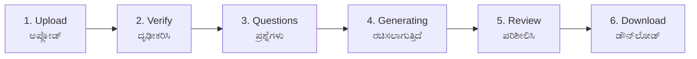

# UI/UX Inspiration — Arcada Prototypes → Aadesh AI

**Harvested:** 2026-04-17
**Source:** Two competing Arcada.app prototypes imitating Aadesh AI brand.
**Purpose:** Durable reference doc. When upgrading the live Next.js app at `aadesh-ai.in`, read this first.
**Scope:** Ideas only (layout, wording, flow order, tokens). Do NOT copy Arcada source. Rebuild in our Tailwind v4 + shadcn stack.

---

## 1. Source Inventory

| # | URL | Variant | Auth | Kannada | Notes |
|---|-----|---------|------|---------|-------|
| A | `https://aadesh-ai-legal-drafting-zp5r.arcada.app/` | Universal Legal Drafting | Email + Password + Google SSO | No | Slate/emerald theme. Has `/monitor` Pilot Mode dashboard (seen via prior Playwright capture). |
| B | `https://aadesh-ai-karnataka-7kud.arcada.app/` | Karnataka Revenue Dept | None (open wizard) | Yes (full bilingual) | Blue→green gradient + gold border. 6-step DDLR flow. |

**Firecrawl scrape IDs (harvested 2026-04-17):**
- Site A: `019d97d4-49b9-709c-b7f7-4632d53a6557`
- Site B: `019d97d4-700e-772c-9586-44b770f3dc7f`

**Screenshot URLs (Google-Storage, ~7-day TTL — re-scrape via `mcp__firecrawl_scrape` if expired):**
- Site A: `storage.googleapis.com/firecrawl-scrape-media/screenshot-c036cd79-bb09-4a40-b9ba-baa8c41f8f10.png`
- Site B: `storage.googleapis.com/firecrawl-scrape-media/screenshot-e6c9837a-998e-4fa7-aa7a-a74a6c060093.png`

**IP note:** Prototypes appear to be third-party builds using "Aadesh AI" brand. Treat as competitive intel. Harvest *patterns* (colors, flow order, wording, layout) — not code files. Rebuild each component from scratch in our stack.

---

## 2. Brand Tokens

### Site B (Karnataka — primary inspiration for production)

| Token | Value | Usage |
|-------|-------|-------|
| `--color-gov-blue` | `rgb(26, 58, 107)` / `#1a3a6b` | Header gradient start, "responsibility" card |
| `--color-gov-green` | `rgb(26, 107, 60)` / `#1a6b3c` | Header gradient end, active stepper, primary CTA |
| `--color-gov-gold` | `rgb(184, 134, 11)` / `#b8860b` | Header bottom border (3px), "verify" card |
| `--color-gov-gold-bright` | `rgb(240, 192, 64)` / `#f0c040` | Shield icon, OFFICIAL USE ONLY text |
| `--color-gov-green-muted` | `rgb(232, 244, 237)` | Trust-card (secure) background |
| `--color-gov-amber-muted` | `rgb(253, 246, 227)` | Trust-card (verify) background |
| `--color-gov-blue-muted` | `rgb(232, 237, 246)` | Trust-card (responsibility) + time-promise bg |
| `--color-warn-cream` | `rgb(255, 248, 225)` | Inline "auto-read" hint bg |
| `--color-warn-text` | `rgb(122, 92, 0)` | Inline hint text |
| `--color-text-muted` | `rgb(176, 190, 197)` | Inactive stepper, secondary copy |
| `--color-border` | `rgb(209, 217, 224)` | Inactive step border, drop-zone dashed border |
| `--color-disabled-btn` | `rgb(160, 174, 192)` | Sticky-CTA disabled bg |

**Header gradient:** `linear-gradient(135deg, rgb(26,58,107) 0%, rgb(26,107,60) 100%)` + `border-bottom: 3px solid rgb(184,134,11)`.

**Active step shadow:** `rgba(26,107,60,0.18) 0px 0px 0px 4px, rgba(26,107,60,0.2) 0px 2px 6px`.

### Site A (Legal Drafting — secondary, slate/emerald)

| Token | Value | Usage |
|-------|-------|-------|
| Slate 900 | `#0f172a` | Header gradient start |
| Slate 800 | `#1e293b` | Header gradient end |
| Emerald 400 | `#34d399` | Shield icon, focus rings |
| Emerald 600 | `#059669` | 3px header bottom border |
| Slate 50 bg | `#f9fafb` | Page body |

Header classes (Tailwind): `bg-gradient-to-r from-slate-900 to-slate-800 text-white shadow-[inset_0_-1px_0_rgba(255,255,255,0.05),0_4px_20px_rgba(0,0,0,0.08)] border-b-[3px] border-emerald-600`.

Input focus: `focus:border-emerald-500 focus:ring-4 focus:ring-emerald-500/10` — steal for auth forms.

---

## 3. Typography

- **Latin:** `"IBM Plex Sans", sans-serif` (Site B body).
- **Kannada:** `.kannada` class → Noto Sans Kannada. Match via `font-family: "Noto Sans Kannada", "IBM Plex Sans", sans-serif` in our `globals.css`.
- **Weights:** 800 (headings, step numbers, stat values). 700 (card titles, buttons). 600 (secondary). 500 (inactive).
- **Letter-spacing:** 0.3px logo word-mark. 0.6–0.9px UPPERCASE micro-labels ("HOW IT WORKS · ಹೇಗೆ ಕಾರ್ಯ ನಿರ್ವಹಿಸುತ್ತದೆ"). -0.2 to -0.3px large H1s.
- **Sizes (px):** H1 22 / H2 18 / body 14 / caption 13 / micro-label 11 / step-number 13 / footer 9–10. Kannada mirrors always 1–2px smaller than English sibling.

---

## 4. Component Catalogue

| Component | Props | Purpose | Target file |
|-----------|-------|---------|-------------|
| `<BiText>` | `en`, `kn`, `variant: "stacked" \| "inline" \| "pipe"` | Render English + Kannada consistently | `aadesh-ai/nextjs/src/components/ui/BiText.tsx` |
| `<GovHeader>` | — | Blue→green gradient, gold 3px border, shield, bilingual word-mark, OFFICIAL USE ONLY badge | replace header in `AppLayout.tsx` |
| `<StepIndicator>` | `steps`, `stepsKn`, `current` | Sticky sub-header: 3px progress bar + 6 circles + active step Kannada name | new `components/pipeline/StepIndicator.tsx` |
| `<HowItWorksMiniMap>` | `active` | 3 pill cards + arrows + amber dot on active | extend `components/HowItWorks.tsx` |
| `<TimePromiseBar>` | `minutes` | Clock + "AI will read and prepare draft in N minutes" + Kannada | new `components/pipeline/TimePromiseBar.tsx` |
| `<UploadDropZone>` | `onFile`, `maxMB` | Dashed border + 80×80 icon tile + Browse button + auto-read hint + "PDF only · Max 10 MB" | enhance `FileUploadStep.tsx` |
| `<TrustCards>` | — | 3 stacked: green shield / amber triangle / blue pen, each with Kannada mirror | new `components/pipeline/TrustCards.tsx` |
| `<StickyBottomCta>` | `helperKn`, `label`, `disabled`, `onClick`, `icon` | Fixed-bottom: Kannada helper above primary/disabled button | new `components/ui/StickyBottomCta.tsx` |
| `<OfficialUseBadge>` | — | Small 2-line stacked gold badge | sub-component of `GovHeader` |
| `<PilotMonitorDashboard>` | — | 4 stat cards + 3 behavior cards + session log table | reserved `app/app/pilot-monitor/page.tsx` |

---

## 5. Flow Diagram



1:1 with existing pipeline components:

| Arcada step | Our component |
|-------------|---------------|
| 1 Upload | `FileUploadStep.tsx` |
| 2 Verify | `VisionReadingStep.tsx` |
| 3 Questions | `QuestionsStep.tsx` |
| 4 Generating | `GeneratingStep.tsx` |
| 5 Review | `PreviewEditorStep.tsx` |
| 6 Download | `DownloadStep.tsx` |

---

## 6. Copy Library (verbatim, bilingual)

### Header
- `Aadesh AI` + `ಆದೇಶ AI`
- Subtitle: `Karnataka Government · Revenue Department`
- Badge: `OFFICIAL / USE ONLY` (2-line stacked, gold on gold-translucent)

### Step 1 (Upload)

| EN | KN |
|----|----|
| Step 1 of 6 | ಅಪ್ಲೋಡ್ |
| Upload Case PDF to Generate Order | ಆದೇಶ ರಚಿಸಲು ಪ್ರಕರಣ PDF ಅಪ್‌ಲೋಡ್ ಮಾಡಿ |
| AI will read your case and prepare a draft order in 2 minutes | AI ನಿಮ್ಮ ಪ್ರಕರಣವನ್ನು ಓದಿ 2 ನಿಮಿಷಗಳಲ್ಲಿ ಆದೇಶ ಕರಡು ತಯಾರಿಸುತ್ತದೆ |
| HOW IT WORKS | ಹೇಗೆ ಕಾರ್ಯ ನಿರ್ವಹಿಸುತ್ತದೆ |
| Upload PDF | PDF ಅಪ್‌ಲೋಡ್ ಮಾಡಿ |
| Verify Details | ವಿವರ ದೃಢೀಕರಿಸಿ |
| Get Draft Order | ಆದೇಶ ಕರಡು ಪಡೆಯಿರಿ |
| Upload Case PDF | ಪ್ರಕರಣ PDF ಅಪ್‌ಲೋಡ್ ಮಾಡಿ |
| Browse File | — |
| or drag & drop your PDF here | — |
| PDF will be read automatically (10–15 seconds) | PDF ಸ್ವಯಂಚಾಲಿತವಾಗಿ ಓದಲ್ಪಡುತ್ತದೆ (10–15 ಸೆಕೆಂಡ್) |
| PDF only · Max 10 MB | — |

### Trust Cards

| EN | KN |
|----|----|
| IMPORTANT | ಮುಖ್ಯ ಮಾಹಿತಿ |
| Your data is secure | ನಿಮ್ಮ ಮಾಹಿತಿ ಸುರಕ್ಷಿತವಾಗಿದೆ |
| You will verify all details before download | ಡೌನ್‌ಲೋಡ್ ಮೊದಲು ಎಲ್ಲಾ ವಿವರ ಪರಿಶೀಲಿಸುವಿರಿ |
| You are responsible for the final order | ಅಂತಿಮ ಆದೇಶಕ್ಕೆ ನೀವು ಜವಾಬ್ದಾರರಾಗಿರುತ್ತೀರಿ |

### Sticky CTA (disabled state)
- Helper: `ಮುಂದುವರಿಯಲು PDF ಅಪ್‌ಲೋಡ್ ಮಾಡಿ`
- Button: `Upload file to continue`

### Stepper labels (all 6)

| # | EN | KN |
|---|----|----|
| 1 | Upload | ಅಪ್ಲೋಡ್ |
| 2 | Verify | ದೃಢೀಕರಿಸಿ |
| 3 | Questions | ಪ್ರಶ್ನೆಗಳು |
| 4 | Generating | ರಚಿಸಲಾಗುತ್ತಿದೆ |
| 5 | Review | ಪರಿಶೀಲಿಸಿ |
| 6 | Download | ಡೌನ್‌ಲೋಡ್ |

---

## 7. Pilot Monitor Spec (Site A `/monitor`)

**Access:** Client-side route behind auth on Site A. In our app: gate via Supabase role `admin` or founder flag.

### Layout

1. **Header:** "Pilot Mode Monitor" — emerald accent, matches main nav.
2. **4 Stat Cards:** `Sessions` · `Completion %` · `Hesitation %` · `Confusion %`
3. **3 Behavior Cards:** `Common Drop-off` · `Avg Checkbox Delay` · `Feedback` (👍/😐/👎)
4. **Raw Session Logs table** — chronological event rows.

### Suggested event schema (localStorage or Supabase table `pilot_events`)

```ts
interface PilotEvent {
  sessionId: string       // uuid per wizard attempt
  userId: string | null   // Supabase user.id, null if anon
  step: 1 | 2 | 3 | 4 | 5 | 6
  event:
    | 'step_enter'
    | 'step_exit'
    | 'pause'             // idle > 10s
    | 'back_nav'
    | 'field_focus'
    | 'field_blur'
    | 'checkbox_tick'
    | 'drop_off'
    | 'feedback'          // payload: { rating: 'up' | 'neutral' | 'down' }
    | 'complete'
  payload?: Record<string, string | number | boolean>
  ts: string              // ISO-8601 UTC
}
```

localStorage fallback key: `aadesh.pilot.events.v1`. Flush to Supabase on `complete` or every 5 events.

---

## 8. Mapping Matrix

| Arcada pattern | Target file in main app |
|----------------|-------------------------|
| Bilingual logo + gradient header + OFFICIAL badge | `aadesh-ai/nextjs/src/components/AppLayout.tsx` |
| `--color-gov-*` tokens | `aadesh-ai/nextjs/src/app/globals.css` + `tailwind.config.ts` |
| Language context EN/KN | `aadesh-ai/nextjs/src/lib/context/LanguageContext.tsx` (exists) |
| i18n key table | `aadesh-ai/nextjs/src/lib/i18n.ts` (exists — extend) |
| 6-circle sticky stepper | new `components/pipeline/StepIndicator.tsx` |
| How-it-works 3-pill mini-map | `components/HowItWorks.tsx` |
| Time-promise bar | new `components/pipeline/TimePromiseBar.tsx` |
| Dashed drop-zone + auto-read hint | `components/pipeline/FileUploadStep.tsx` |
| 3-color trust cards | new `components/pipeline/TrustCards.tsx` |
| Sticky bottom CTA | new `components/ui/StickyBottomCta.tsx` |
| `<BiText>` primitive | new `components/ui/BiText.tsx` |
| Emerald focus rings on auth inputs | `app/auth/login/page.tsx` + `register/page.tsx` |
| Google SSO button style (Site A) | existing `components/SSOButtons.tsx` — polish |
| Pilot Mode Monitor dashboard | new `app/app/pilot-monitor/page.tsx` |
| Event tracker | new `lib/pilot/tracker.ts` |
| IBM Plex + Noto Sans Kannada fonts | `app/layout.tsx` (font imports) + `globals.css` `.kannada` class |

All targets grep-verified to exist (or be new files in existing dir) 2026-04-17.

---

## 9. Priority Ranking (20 patterns)

| # | Pattern | Priority | Reason |
|---|---------|----------|--------|
| 1 | `<BiText>` primitive | **P0** | Unblocks every bilingual component. Cheap. |
| 2 | `<StepIndicator>` | **P0** | Biggest perceived-quality jump; missing today. |
| 3 | `<TrustCards>` | **P0** | Addresses Banu's concern about AI accuracy & liability. |
| 4 | `<StickyBottomCta>` | **P0** | Mobile usability — current CTA scrolls out of view. |
| 5 | `<GovHeader>` | **P0** | Signals govt. legitimacy — critical for tender-free sales. |
| 6 | Brand tokens `--color-gov-*` in Tailwind | P1 | Prereq for #5. |
| 7 | `<TimePromiseBar>` | P1 | Reduces bail-out at upload. |
| 8 | `<UploadDropZone>` upgrade | P1 | Better affordance. |
| 9 | Stepper Kannada labels + `ಹೆಜ್ಜೆ 1/6` | P1 | Completes bilingual stepper. |
| 10 | `<HowItWorksMiniMap>` | P1 | Sets expectations at wizard entry. |
| 11 | Emerald focus ring on auth inputs | P1 | 5-min polish; visible quality. |
| 12 | IBM Plex + Noto Sans Kannada font loading | P1 | Foundation for §3. |
| 13 | OFFICIAL USE ONLY 2-line gold badge | P2 | Nice detail; low effort. |
| 14 | Micro-label pattern (11px, 0.9px, bilingual pipe) | P2 | Visual consistency. |
| 15 | Muted bg trust-card 3-hue variants | P2 | Spec'd via #3. |
| 16 | "PDF only · Max 10 MB" footer | P2 | Inside `<UploadDropZone>`. |
| 17 | Amber hint card "auto-read 10–15s" | P2 | Reuses token set. |
| 18 | Pilot event tracker `lib/pilot/tracker.ts` | P2 | Prereq for dashboard. |
| 19 | `<PilotMonitorDashboard>` (admin-gated) | Nice-to-have | Valuable but not blocker for Banu pilot. |
| 20 | Confetti on Step 6 + Kannada success msg | Nice-to-have | Delight. |

20 rows, no dupes.

---

## 10. Out of Scope

- **Arcada `api/generate.js`** — hardcoded templates, fake AI. DO NOT copy.
- **Arcada auth flow** — we already use Supabase. Steal only button styling.
- **State-based routing** — both Arcada sites use in-memory state, no real URLs. Keep our `/app/app/pipeline` scheme.
- **User-impersonation 3-up selector on Site A home** — demo trick, irrelevant post-launch.

---

## 11. Legal / IP Note

Both sites appear to be **third-party builds** using the "Aadesh AI" brand (likely competitor or unauthorized partner, not Srinivas). Treatment:

- Competitive intel — harvest *ideas* freely (layout, flow, wording is not copyrightable).
- **Do not** fork their code, images, or exact CSS classes.
- Rebuild each component from scratch in our Tailwind v4 + shadcn stack.
- Kannada UI strings are generic translations of common verbs — reuse freely.
- Brand-misuse confrontation is a separate legal track — not this doc's concern.

---

## 12. How To Use This Doc

Future session prompt template:

> Read `DDLR Strategy & Planning/UI_UX_INSPIRATION_FROM_ARCADA.md`. Implement P0 patterns #1–5 into `aadesh-ai/nextjs/src/**`. Use §8 Mapping Matrix for exact paths and §6 Copy Library for verbatim bilingual strings. Don't invent new tokens — use §2.

When screenshots expire, re-scrape:

```
mcp__firecrawl_scrape url=https://aadesh-ai-karnataka-7kud.arcada.app/ formats=[markdown,screenshot,html]
mcp__firecrawl_scrape url=https://aadesh-ai-legal-drafting-zp5r.arcada.app/ formats=[markdown,screenshot,html]
```

---

*Last updated 2026-04-17 by Claude Code.*

---

## 13. Appendix B — Verified Interaction States (Playwright Deep-Walk, 2026-04-17)

> Static Firecrawl scrape captured layout. This section captures **live interaction states, transitions, and copy** verified by clicking through every step.

---

### Site B — Full 6-Step Walkthrough (aadesh-ai-karnataka-7kud.arcada.app)

#### Step 1 — Upload (2 states)

| State | CTA Text | CTA Colour | Helper Text |
|-------|----------|------------|-------------|
| Before upload | "Upload file to continue" | Grey / disabled | "ಮುಂದುವರಿಯಲು PDF ಅಪ್‌ಲೋಡ್ ಮಾಡಿ" |
| After upload success | "Continue to Verification →" | Green / enabled | "✓ ಪರಿಶೀಲನೆಗೆ ಮುಂದುವರಿಯಿರಿ" |

Upload success panel shows:
- Green check icon + "PDF Read Successfully" / "ಪ್ರಕರಣ ವಿವರಗಳು ಯಶಸ್ವಿಯಾಗಿ ಓದಲ್ಪಟ್ಟಿವೆ"
- "EXTRACTED DETAILS · ಹೊರತೆಗೆದ ವಿವರಗಳು" panel: Case No, Survey, Pages Detected
- File chip with remove button appears above drop zone

#### Step 2 — Verify

- Stepper: Step 1 dot → ✓ green
- 3 accordion sections, each with bilingual label + Edit button:

| Section EN | Section KN | Fields |
|-----------|-----------|--------|
| Case Identification | ಪ್ರಕರಣ ಗುರುತಿಸುವಿಕೆ | Case Number (VERIFY badge), Case Date |
| Land & Location Details | ಭೂಮಿ ಮತ್ತು ಸ್ಥಳ ವಿವರ | Survey Number (CRITICAL), Village Name (VERIFY), Taluk, District |
| Parties Involved | ಪ್ರಕರಣದ ಪಕ್ಷಗಳು | Appellant Name (CRITICAL), Respondent Name (CRITICAL) |

- Field badges: **CRITICAL** = "errors invalidate the order / ತಪ್ಪಾದರೆ ಆದೇಶ ಅಮಾನ್ಯ" | **VERIFY** = "Verify exact format / ನಿಖರ ಸ್ವರೂಪ ಪರಿಶೀಲಿಸಿ"
- Critical Fields Summary (always visible, not in accordion): Survey Number ✓, Appellant Name ✓, Respondent Name ✓
- Legal notice: "You are legally responsible for verifying all details. Incorrect information may lead to invalid orders." / "ಎಲ್ಲಾ ವಿವರಗಳನ್ನು ಪರಿಶೀಲಿಸುವ ಜವಾಬ್ದಾರಿ ನಿಮ್ಮದು. ತಪ್ಪು ಮಾಹಿತಿಯಿಂದ ಆದೇಶ ಅಮಾನ್ಯವಾಗಬಹುದು."
- Checkpoint checkbox (blocks CTA until checked): "I have verified all details and confirm they are correct" / "ನಾನು ಎಲ್ಲಾ ವಿವರಗಳನ್ನು ಪರಿಶೀಲಿಸಿದ್ದೇನೆ ಮತ್ತು ಅವು ಸರಿಯಾಗಿವೆ ಎಂದು ದೃಢಪಡಿಸುತ್ತೇನೆ"
- Hint when CTA disabled: "✓ ಚೆಕ್‌ಬಾಕ್ಸ್ ಆಯ್ಕೆ ಮಾಡಿದ ನಂತರ ಮುಂದುವರಿಯಬಹುದು"

#### Step 3 — Questions (5 questions, sub-stepper)

Sub-stepper: "QUESTION N OF 5 · ಪ್ರಶ್ನೆ N / 5" + ⚡ QUICK badge + 5 progress dots (completed = ✓)

Growing "ANSWERED · ಉತ್ತರಿಸಿದ ಪ್ರಶ್ನೆಗಳು" summary appends each answer with Edit button.

| Q# | Category EN | Category KN | Question EN | Options |
|----|------------|------------|-------------|---------|
| 1 | FINAL DECISION | ಅಂತಿಮ ನಿರ್ಧಾರ | Select the decision for this case | Allow Appeal / Dismiss Appeal / Partially Allow / Remand for Re-hearing |
| 2 | NOTICE SERVED | ನೋಟೀಸ್ ನೀಡಿಕೆ | Was notice served to all parties? | Yes — Notice Served / No — Not Served / Partially Served |
| 3 | RELATED CASES | ಸಂಬಂಧಿತ ಪ್ರಕರಣಗಳು | Are there any related cases? | Yes — Enter case number / No Related Cases |
| 4 | HEARING CONDUCTED | ವಿಚಾರಣೆ ನಡೆಸಲಾಗಿದೆಯೇ | Was a hearing conducted? | Yes — In Person / Written Submissions Only / No Hearing |
| 5 | ORDER DATE | ಆದೇಶದ ದಿನಾಂಕ | Confirm the order date | Date picker (auto-filled today; "ಇಂದಿನ ದಿನಾಂಕ ಸ್ವಯಂಚಾಲಿತವಾಗಿ ತುಂಬಲಾಗಿದೆ. ಅಗತ್ಯವಿದ್ದರೆ ಬದಲಾಯಿಸಿ.") |

Q5 CTA changes to **"Generate Draft Order"** (not "Next").
CTA disabled hint: "↑ ಮೇಲಿನ ಆಯ್ಕೆಗಳಲ್ಲಿ ಒಂದನ್ನು ಆರಿಸಿ ಮುಂದುವರಿಯಿರಿ"

#### Step 4 — Generating

- No nav buttons during generation (cannot go Back or Next)
- Progress card: "AI is working... / AI ಕಾರ್ಯನಿರ್ವಹಿಸುತ್ತಿದೆ..." + percentage counter
- Numbered generation checklist (5 steps with ✓ / PENDING states):
  1. (PDF reading)
  2. Analyzing references / ಉಲ್ಲೇಖಗಳನ್ನು ವಿಶ್ಲೇಷಿಸುತ್ತಿದೆ
  3. Drafting order / ಆದೇಶ ರಚಿಸುತ್ತಿದೆ
  4. Applying relevant legal provisions / ಸಂಬಂಧಿತ ಕಾನೂನು ನಿಬಂಧನೆಗಳನ್ನು ಅನ್ವಯಿಸಲಾಗುತ್ತಿದೆ
  5. Finalizing document / ದಾಖಲೆ ಅಂತಿಮಗೊಳಿಸುತ್ತಿದೆ
- Live preview card: "DRAFT PREVIEW · ಕರಡು ಪೂರ್ವವೀಕ್ಷಣೆ" with green **LIVE** badge; text streams in character-by-character
- Warning: "Do not close this page / ಈ ಪುಟವನ್ನು ಮುಚ್ಚಬೇಡಿ"

#### Step 5 — Review

- Sub-label: "Draft generated using your reference orders / ನಿಮ್ಮ ರೆಫರೆನ್ಸ್ ಆದೇಶಗಳನ್ನು ಬಳಸಿ ರಚಿಸಲಾಗಿದೆ"
- Document sections (each: EN label + KN label + Edit button):

| Section | KN Label | Special |
|---------|----------|---------|
| HEADER | ಕಚೇರಿ ಶೀರ್ಷಿಕೆ | — |
| CASE DETAILS | ಪ್ರಕರಣ ವಿವರ | — |
| FACTS | ಪ್ರಕರಣದ ಸಂಗತಿಗಳು | — |
| ANALYSIS | ವಿಶ್ಲೇಷಣೆ | — |
| FINAL ORDER | ಅಂತಿಮ ಆದೇಶ | ⚠ VERIFY badge |
| SIGNATURE | ಸಹಿ ವಿಭಾಗ | — |

- Jump-to-section nav pills (always visible): HEADER | CASE DETAILS | FACTS | ANALYSIS | FINAL ORDER | SIGNATURE
- Warning: "You are responsible for final approval / ಅಂತಿಮ ಅನುಮೋದನೆಗೆ ನೀವು ಜವಾಬ್ದಾರರಾಗಿರುತ್ತೀರಿ"
- Sticky CTA: "Proceed to Final Verification →"

#### Step 6 — Download

- File ready chip: `Order_RRT_2024_0047.docx` | "Microsoft Word (.docx) · Kannada · Ready to print"
- COMPLETED STEPS checklist (all ✓, bilingual):
  1. Case file uploaded / ಪ್ರಕರಣ ಫೈಲ್ ಅಪ್‌ಲೋಡ್ ಮಾಡಲಾಗಿದೆ
  2. Case details verified / ಪ್ರಕರಣ ವಿವರ ಪರಿಶೀಲಿಸಲಾಗಿದೆ
  3. Questions answered / ಪ್ರಶ್ನೆಗಳಿಗೆ ಉತ್ತರಿಸಲಾಗಿದೆ
  4. Draft generated by AI / AI ಕರಡು ರಚಿಸಲಾಗಿದೆ
  5. Draft reviewed & edited / ಕರಡು ಪರಿಶೀಲಿಸಿ ಸಂಪಾದಿಸಲಾಗಿದೆ
- ORDER SUMMARY: Case Number + Survey Number + Appellant + Final Decision
- Pre-download warning (red, 3 items):
  1. "You have reviewed and verified all details." / "ನೀವು ಎಲ್ಲಾ ವಿವರಗಳನ್ನು ಪರಿಶೀಲಿಸಿದ್ದೀರಿ."
  2. "You are responsible for the final order." / "ಅಂತಿಮ ಆದೇಶಕ್ಕೆ ನೀವು ಜವಾಬ್ದಾರರು."
  3. "Incorrect orders may have legal consequences." / "ತಪ್ಪು ಆದೇಶಗಳಿಂದ ಕಾನೂನು ಪರಿಣಾಮಗಳಾಗಬಹುದು."
- Second checkpoint checkbox: "I have reviewed and verified this order / ನಾನು ಈ ಆದೇಶವನ್ನು ಪರಿಶೀಲಿಸಿ ದೃಢೀಕರಿಸಿದ್ದೇನೆ"
- Hint: "↑ ಡೌನ್‌ಲೋಡ್ ಮಾಡಲು ಮೇಲಿನ ಚೆಕ್‌ಬಾಕ್ಸ್ ಆಯ್ಕೆ ಮಾಡಿ"
- CTA: "Download DOCX" (disabled until checkbox) + hint "✓ ಚೆಕ್‌ಬಾಕ್ಸ್ ಆಯ್ಕೆ ಮಾಡಿದ ನಂತರ ಡೌನ್‌ಲೋಡ್ ಸಕ್ರಿಯವಾಗುತ್ತದೆ"
- Post-download note: "After downloading: print, sign, and submit through official channels." / "ಡೌನ್‌ಲೋಡ್ ನಂತರ: ಮುದ್ರಿಸಿ, ಸಹಿ ಮಾಡಿ ಮತ್ತು ಅಧಿಕೃತ ಮಾರ್ಗದಲ್ಲಿ ಸಲ್ಲಿಸಿ."

---

### Site A — Additional Screens (aadesh-ai-legal-drafting-zp5r.arcada.app)

#### Auth Screen
- Login: Email + Password OR "Sign in with Google" (Supabase OAuth)
- No bilingual on auth screen — English only

#### Profile Selection Screen (post-auth, pre-wizard)

| Role EN | Role KN | Description EN |
|---------|---------|----------------|
| Government Officer | ಸರ್ಕಾರಿ ಅಧಿಕಾರಿ | Draft official orders, memos, and circulars. |
| Advocate / Lawyer | ವಕೀಲರು | Draft petitions, notices, and legal agreements. |
| General User | ಸಾಮಾನ್ಯ ಬಳಕೆದಾರ | Draft standard letters, applications, and documents. |

Bilingual sub-text on each card (Kannada translation of description).

#### Site A Wizard Step 1 — Reference Documents (different from Site B)

Site A uploads **previous finished orders** (3-5 docs) to teach AI your style — NOT a case PDF.
- Sub-label on step 1: "Step 1 of 6 | Reference Files"
- Header confidence bar: "AI trained on 0 documents · Using your reference format | Confidence: **LOW**"
- Warning: "References Required — Upload at least 3 reference documents to continue." / "ಮುಂದುವರಿಸಲು ಕನಿಷ್ಠ 3 ಉಲ್ಲೇಖ ದಾಖಲೆಗಳನ್ನು ಅಪ್‌ಲೋಡ್ ಮಾಡಿ."
- Drop zone: "Browse Files or Drag & Drop / ಫೈಲ್‌ಗಳನ್ನು ಬ್ರೌಸ್ ಮಾಡಿ ಅಥವಾ ಎಳೆಯಿರಿ" — PDF / DOCX supported
- CTA: "Verify Structure / ರಚನೆಯನ್ನು ಪರಿಶೀಲಿಸಿ" (disabled until 3 files)
- Cancel: "Cancel Session (ಅಧಿವೇಶನ ರದ್ದುಮಾಡಿ)"

#### Pilot Mode Monitor — Live Layout

URL: `/monitor` (accessible via bar-chart icon in header, auth required)

| Row | Card | Icon colour | Metric |
|-----|------|-------------|--------|
| Top | SESSIONS | Blue | Count of unique session IDs |
| Top | COMPLETION | Green ✓ | % sessions that reached step 6 complete event |
| Top | HESITATION | Orange ⏱ | % sessions with pause events |
| Top | CONFUSION | Red ⚠ | % sessions with drop_off events |
| Bottom | COMMON DROP-OFF | Arrow icon | Step name where most drop_off events fired |
| Bottom | AVG CHECKBOX DELAY | Pencil icon | Average ms between step_enter and checkbox_tick |
| Bottom | FEEDBACK | Emoji | 👍 count / 😐 count / 👎 count |

Below cards: **RAW SESSION LOGS** table (empty state: "No sessions recorded yet.")
Top-right: **Clear Data** button (red, clears `aadesh_logs` localStorage key).

**localStorage schema confirmed:**
```
aadesh_logs         — JSON array of PilotEvent objects (see Section 7)
aadesh_autosave_draft — JSON string, autosaved draft content
```

**Backend:** Supabase (`haiisowfkannskthvckn.supabase.co`). Real-time via `/api/broadcast` (Phoenix channel / WebSocket). Monitor polls or subscribes to broadcast for live updates.

---

### Interaction Patterns — Cross-Step Summary

| Pattern | Where | Behaviour |
|---------|-------|-----------|
| Disabled→Green CTA | Every step | Grey/disabled until required action; turns green on completion |
| Checkpoint checkbox | Steps 2 + 6 | Legal accountability gate; CTA locked until explicitly checked |
| Growing answered summary | Step 3 | Each answered Q appended below with Edit button |
| Field criticality badges | Step 2 | CRITICAL (red) = order-invalidating / VERIFY (blue) = format check |
| Live streaming preview | Step 4 | Text streams character-by-character into DRAFT PREVIEW card with LIVE badge |
| Jump-to-section pills | Step 5 | HEADER / CASE DETAILS / FACTS / ANALYSIS / FINAL ORDER / SIGNATURE |
| Stepper completion state | All | Completed = ✓ green; Active = number dark; Future = number grey |
| Back nav always present | Steps 2–6 | "← Back" always accessible (no trapped states) |
| Post-download instruction | Step 6 | Explicit: print → sign → submit through official channels |
| Confidence indicator | Site A header | "AI trained on N documents · Confidence: LOW/MED/HIGH" |
| Role-based persona | Site A only | 3 roles set document format + tone before wizard starts |
